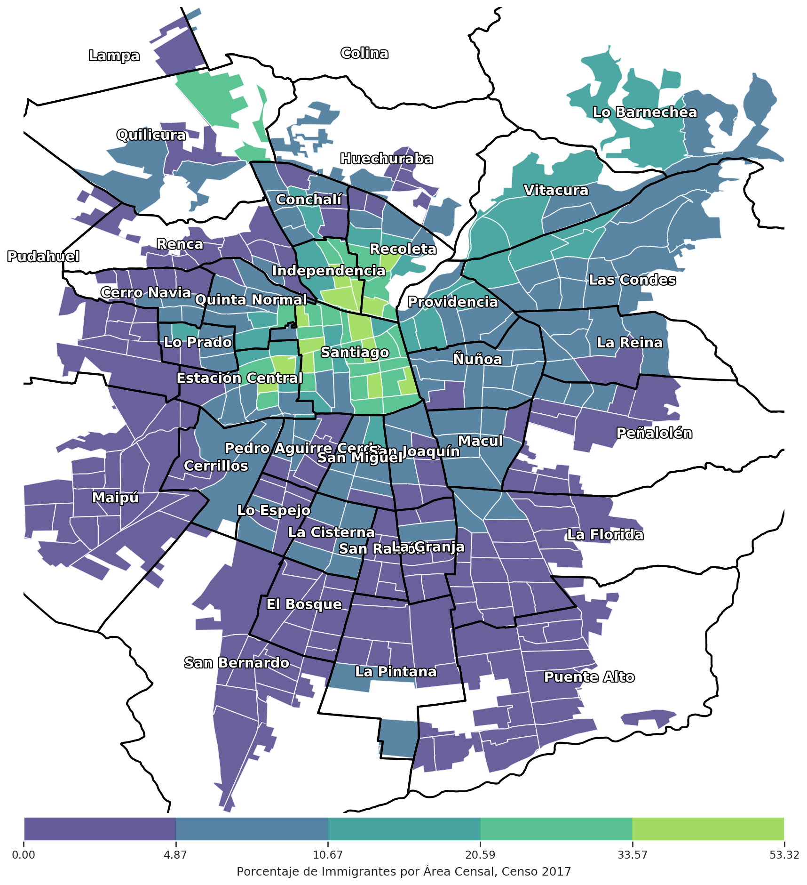

# Análisis Exploratorio de los Microdatos del Censo 2017

Por [**Eduardo Graells-Garrido** (@carnby)](https://twitter.com/carnby), <eduardo.graells@bsc.es>

Este repositorio contiene dos notebooks de [Project Jupyter](https://jupyter.org/), utilizando el lenguaje de programación Python, para responder preguntas y hacer análisis exploratorio del Censo 2017 de Chile.

Los datos se han obtenido de las siguientes fuentes (y están incluidos en este repositorio):

  * [Microdatos del Censo 2017](http://www.censo2017.cl/microdatos/)
  * [Shapefile de Distritos Censales](https://github.com/justinelliotmeyers/official_chile_2017_census_boundary_shapefile)
  * [Shapefile de áreas urbanas del país](https://www.bcn.cl/siit/mapas_vectoriales/index_html)

Éste es uno de los mapas resultantes del primer notebook, correspondiente a la distribución de inmigrantes en el área urbana de Santiago:

Y éste es uno de los resultados del segundo notebook, correspondiente a la distribución temporal del año de llegada al país de les inmigrantes, dependiendo de su lugar de origen:

También incluye un ejemplo de como hacer un mapa de coropletas bivariado:

